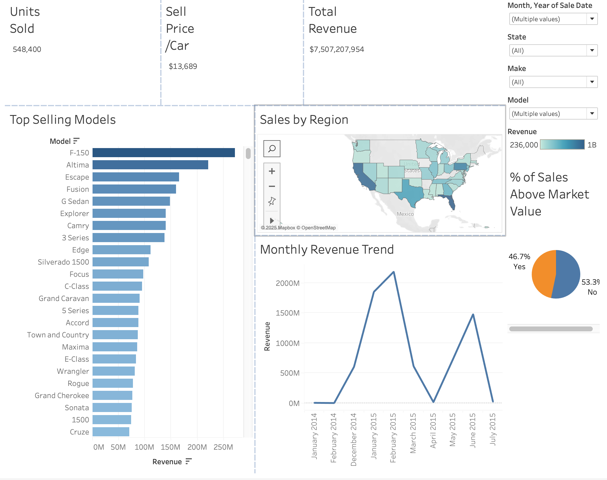

# Vehicle Sales Performance Dashboard

📊 A Tableau dashboard analyzing U.S. vehicle sales across time, region, and model performance. Includes pricing analysis vs. MMR and top-selling models.

🔧 Built with Tableau Desktop using a dataset of over 500,000 vehicle transactions.

## Key Features
- Revenue trend over time
- Sales by state
- Top 20 models by revenue
- % of sales above market value (MMR)

